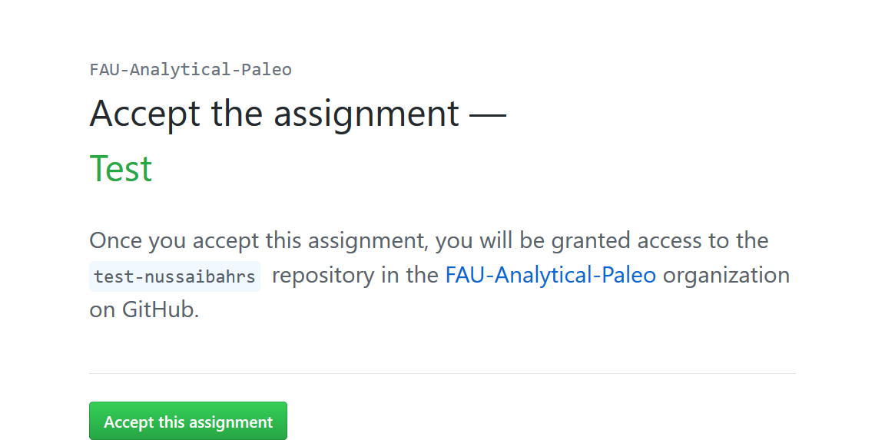
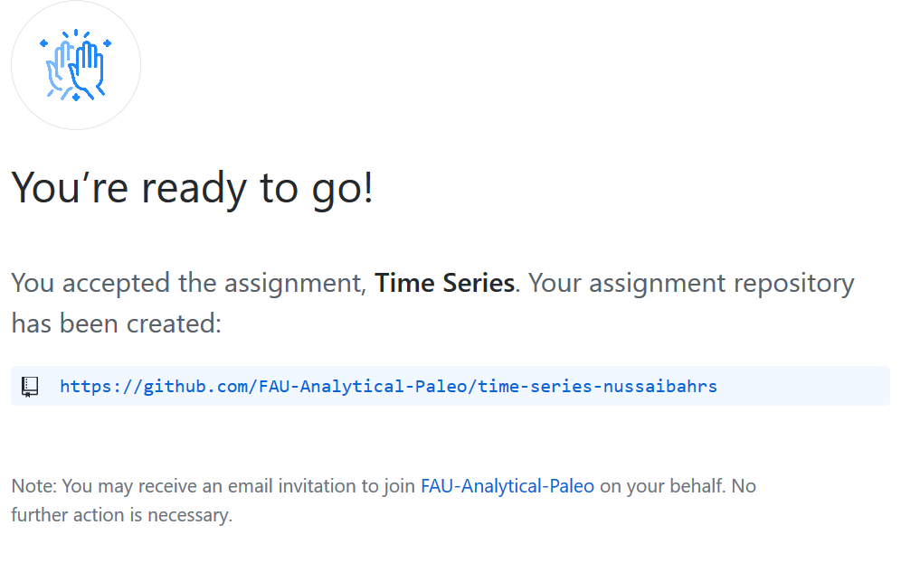
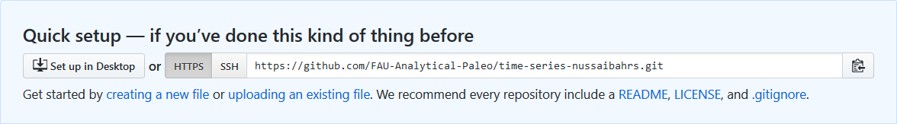

GitHub Classroom Guide for Students
================

This is a guide for students to use GitHub and GitHub Classroom, with
RStudio. You should have already completed the tutorial to setup (Git
with
RStudio)\[<https://github.com/jfiksel/github-classroom-for-students/blob/master/README.md>\].

### Steps for downloading and editing assignments from GitHub Classroom

1.  Have a folder specifically for your class (call it something like
    course-name-2020). Within this folder, I would recommend a folder
    titled lectures, as well a folder title homework.

Here is a basic illustration of how my directory structure looks:

    Users
    │
    │
    │
    └───nussa
        │
        │
        │
        └───documents
            │
            │
            |
            |---analytical-paleo-2020
                |
                |
                |
                |---assignments
                |
                |
                |---lectures

2.  We will give you a link to an assignment, either through email. This
    will happen for each new homework. Then follow the instructions for
    getting the homework repository set up. You should now have a
    repository for this homework. Note that after you accept an
    assignment for the first time, we will send you an invite to join
    the classroom organization as a member. Please accept this. You will
    probably get an email with the invitation, but you should also see a
    link at the top of your main GitHub page. Here is an image of what
    you should see after clicking the link and selecting your ID:

You’ll then be informed that a repository has been created for you.

3.  Go to the link on your browser to check it out. You should see
    something link below:

4.  Copy the link and now go to RStudio to set the repository locally.
    In RStudio, go to *File* -\> *New Project*. Click on *Version
    Control*, then *Git*. Paste the link you just copied into the
    Repository URL box. Leave the Project directory name blank. Create
    this as a subdirectory of your homeworks folder. An RStudio project
    should now open up, which will allow you to start working on your
    homework assignment.

5.  Your Rscripts will go in this folder. After you make changes to the
    homework assignment, commit them. **What are commits?** Commits are
    essentially taking a snapshot of your projects. For example, if I
    make changes to a code so that it prints “Hello world”, and then
    commit them with an informative message, I can look at the history
    of my commits and view the code that I wrote at that time. If I made
    some more changes to the function that resulted in an error, I could
    go back to the commit where the code was originally working. This
    prevents you from creating several versions of your homework
    (homework-v1, homework-v2, …) or from trying to remember what your
    code originally looked like.

You can make commits using the GIT toolbar in RStudio (in RStudio make
sure the toolbar is visible by doing View -\> Show Toolbar). Click the
Commit button in the GIT toolbar dropdown menu. Check the files that you
want to commit, enter your commit message, then hit Commit. Here is also
a short GIF showing how to do this:

Two things about committing. **One**, you should commit somewhat
frequently. At minimum, if you’re doing a homework assignment, you
should make a commit each time that you’ve finished a task or plan to
stop for a while. **Two**, leave informative commit messages. “Added
stuff” will not help you if you’re looking at your commit history in a
year. A message like “Added initial version of hello-world function”
will be more useful.

6.  At some point you’ll want to get the updated version of the
    assignment back onto GitHub, so that teachers/TAs can help you with
    your code. If you are ready to upload the updated version, you can
    again click on the GIT toolbar dropdown menu in RStudio, and then
    click `Push` button (it’s the green arrow facing up). You can also
    do this after you commit in RStudio by clicking Push in the top
    right corner of the Commit pop-up box. Here is a visualization of
    both options:

### Resources

  - [Happy Git and GitHub for the useR](http://happygitwithr.com/)
  - [The Unix Workbench](http://seankross.com/the-unix-workbench/)
  - [Interactive learning guide for
    Git](http://learngitbranching.js.org/)
  - [GitHub Guides](https://guides.github.com/)
  - [Git setup for Windows (video)](https://youtu.be/F_fPEMnr1OQ)
  - [Git setup for Mac
    (video)](https://www.youtube.com/watch?v=kbmSZwK0k-A&t)
  - [How to clone, edit, and push homework assignments with GitHub
    Classroom (video)](https://youtu.be/pAcMgGbCtQw)

Adapted from:<https://github.com/jfiksel/github-classroom-for-students>
